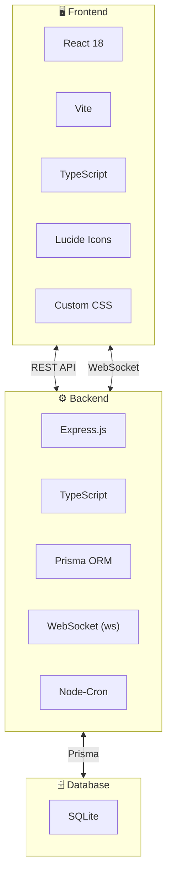
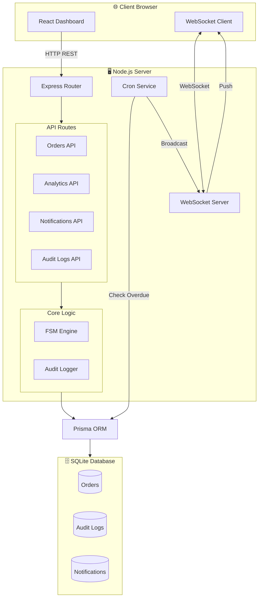
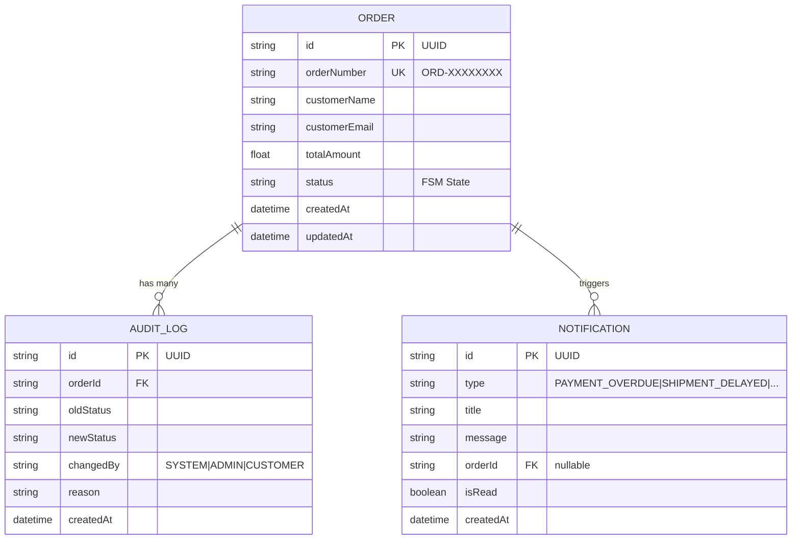
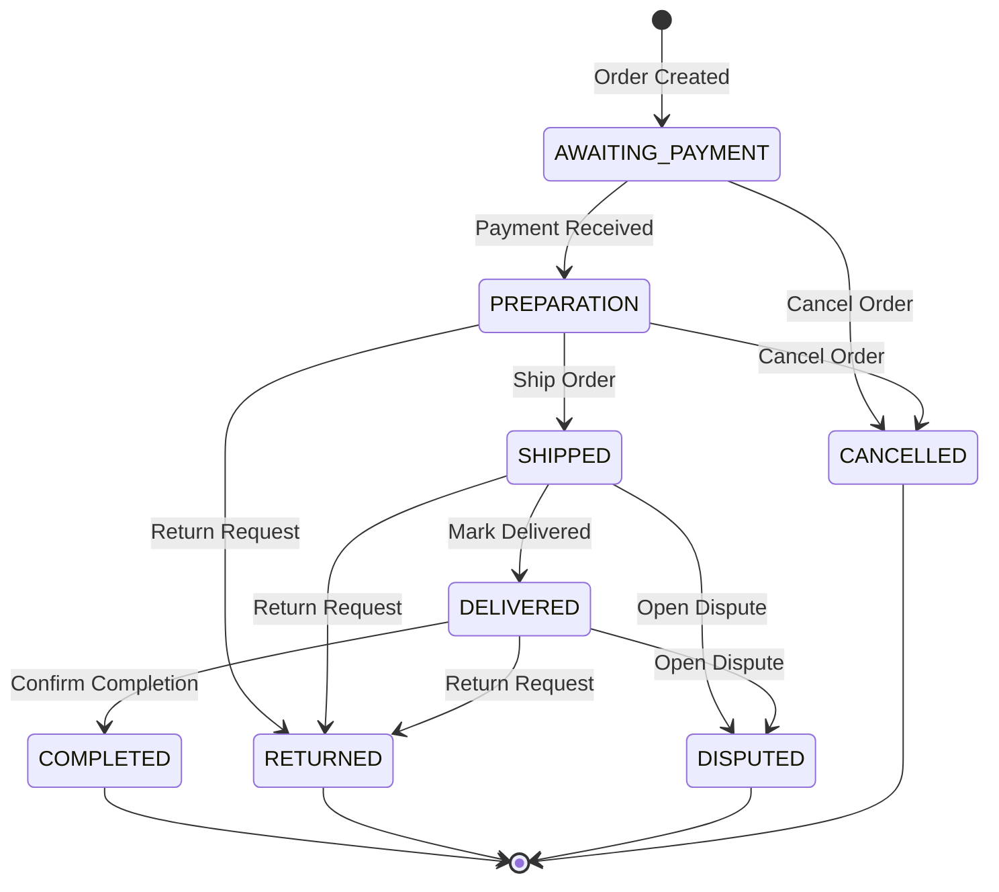

# 🛒 Marketplace Admin System POC

> **Professional Proof of Concept** demonstrating enterprise-grade order management with FSM, real-time notifications, and automated workflows.

---

## 📋 Table of Contents

1. [System Overview](#-system-overview)
2. [Tech Stack](#️-tech-stack)
3. [Installation Guide](#-installation-guide)
4. [Project Structure](#-project-structure)
5. [System Architecture](#-system-architecture)
6. [Database Schema](#️-database-schema)
7. [FSM Order Flow](#-fsm-order-flow)
8. [API Endpoints](#-api-endpoints)
9. [New Features](#-new-features-v20)
10. [Author](#-author)

---

## 🎯 System Overview

This POC demonstrates a complete **Marketplace Admin System** with:

| Feature | Description |
|---------|-------------|
| **FSM Order Management** | 8 states with controlled transitions |
| **Cron Jobs** | Automated payment & shipping alerts |
| **WebSocket** | Real-time notifications |
| **Audit Log** | Full traceability (who, when, what) |
| **Charts & Analytics** | Sales trends & order distribution |

---

## 🛠️ Tech Stack



### Libraries & Dependencies

| Package | Version | Purpose |
|---------|---------|---------|
| **Backend** |||
| express | ^4.18.2 | HTTP Server |
| prisma | ^5.7.0 | Database ORM |
| ws | ^8.14.2 | WebSocket |
| node-cron | ^3.0.3 | Scheduled Jobs |
| date-fns | ^2.30.0 | Date Utilities |
| cors | ^2.8.5 | CORS Middleware |
| **Frontend** |||
| react | ^18.2.0 | UI Library |
| vite | ^5.0.0 | Build Tool |
| lucide-react | ^0.294.0 | SVG Icons |
| typescript | ^5.3.0 | Type Safety |

---

## 📦 Installation Guide

### Prerequisites
- Node.js v18+
- npm v9+

### Step 1: Clone Repository
```bash
git clone https://github.com/YOUR_USERNAME/marketplace-admin-system.git
cd marketplace-admin-system
```

### Step 2: Backend Setup
```bash
cd Backend
npm install
npx prisma generate
npx prisma db push
npx prisma db seed
npm run dev
```

### Step 3: Frontend Setup (New Terminal)
```bash
cd Frontend
npm install
npm run dev
```

### 🔗 Access URLs
| Service | URL |
|---------|-----|
| Frontend | http://localhost:5173 |
| Backend API | http://localhost:3001 |
| WebSocket | ws://localhost:3001/ws |

---

## 📁 Project Structure

```
📦 Marketplace Admin System/
├── 📂 Backend/
│   ├── 📂 prisma/
│   │   ├── schema.prisma      # Database Schema
│   │   └── seed.ts            # Sample Data
│   ├── 📂 src/
│   │   ├── 📂 constants/
│   │   │   └── orderStatus.ts # FSM States & Transitions
│   │   ├── 📂 utils/
│   │   │   └── orderUtils.ts  # Helper Functions
│   │   ├── 📂 services/
│   │   │   ├── websocket.ts   # Real-time Service
│   │   │   └── cron.ts        # Automation Jobs
│   │   ├── 📂 routes/
│   │   │   ├── orders.ts      # CRUD + FSM
│   │   │   ├── notifications.ts
│   │   │   ├── analytics.ts   # Charts Data
│   │   │   ├── auditLogs.ts   # Timeline + Export
│   │   │   └── emailTemplates.ts
│   │   └── index.ts           # Server Entry
│   ├── package.json
│   └── tsconfig.json
│
├── 📂 Frontend/
│   ├── 📂 src/
│   │   ├── 📂 components/
│   │   │   ├── 📂 charts/
│   │   │   │   ├── SalesChart.tsx
│   │   │   │   └── PieChart.tsx
│   │   │   ├── OrderTimeline.tsx
│   │   │   ├── SearchFilters.tsx
│   │   │   ├── EmailTemplates.tsx
│   │   │   └── index.ts
│   │   ├── 📂 services/
│   │   │   ├── api.ts         # API Client
│   │   │   └── websocket.ts   # WS Client
│   │   ├── App.tsx            # Main Component
│   │   ├── App.css
│   │   └── index.css          # Design System
│   ├── package.json
│   └── vite.config.ts
│
├── .gitignore
└── README.md
```

---

## 🏗️ System Architecture



---

## 🗃️ Database Schema



### Table Details

| Table | Purpose | Key Fields |
|-------|---------|------------|
| **Order** | Core entity | `status` (FSM state), `orderNumber` |
| **AuditLog** | Tracks all changes | `oldStatus`, `newStatus`, `changedBy` |
| **Notification** | System alerts | `type`, `isRead` |

---

## 🔄 FSM Order Flow



### State Transitions Table

| From | Allowed Transitions |
|------|---------------------|
| `AWAITING_PAYMENT` | PREPARATION, CANCELLED |
| `PREPARATION` | SHIPPED, CANCELLED, RETURNED |
| `SHIPPED` | DELIVERED, RETURNED, DISPUTED |
| `DELIVERED` | COMPLETED, RETURNED, DISPUTED |
| `COMPLETED` | *(End State)* |
| `RETURNED` | *(End State)* |
| `DISPUTED` | *(End State)* |
| `CANCELLED` | *(End State)* |

---

## 📡 API Endpoints

### Orders API

| Method | Endpoint | Description |
|--------|----------|-------------|
| `GET` | `/api/orders` | List all orders with audit logs |
| `GET` | `/api/orders/:id` | Get single order with timeline |
| `GET` | `/api/orders/search` | Advanced search with filters |
| `POST` | `/api/orders` | Create new order |
| `PATCH` | `/api/orders/:id/status` | **FSM-validated** status change |

#### Status Change Request
```json
{
  "newStatus": "PREPARATION",
  "changedBy": "ADMIN",
  "reason": "Payment confirmed"
}
```

#### Status Change Response
```json
{
  "success": true,
  "message": "Order status updated successfully",
  "data": {
    "order": { "id": "...", "status": "PREPARATION" },
    "transition": {
      "from": { "status": "AWAITING_PAYMENT", "label": "⏳ Awaiting Payment" },
      "to": { "status": "PREPARATION", "label": "📦 Preparation" },
      "changedBy": "ADMIN",
      "timestamp": "2026-01-03T19:00:00.000Z"
    }
  }
}
```

### Analytics API

| Method | Endpoint | Description |
|--------|----------|-------------|
| `GET` | `/api/analytics/dashboard` | KPIs (orders, revenue, alerts) |
| `GET` | `/api/analytics/sales-chart` | 30-day sales data |
| `GET` | `/api/analytics/status-distribution` | Pie chart data |
| `GET` | `/api/analytics/top-customers` | Top 5 customers |

### Other APIs

| Method | Endpoint | Description |
|--------|----------|-------------|
| `GET` | `/api/audit-logs` | All status changes |
| `GET` | `/api/audit-logs/order/:id` | Order timeline |
| `GET` | `/api/audit-logs/export` | CSV download |
| `GET` | `/api/notifications` | System alerts |
| `PATCH` | `/api/notifications/read-all` | Mark all read |
| `GET` | `/api/email-templates` | Template list |
| `POST` | `/api/email-templates/:id/preview` | HTML preview |

---

## ✨ New Features (v2.0)

### 1. Dashboard Charts
- **Sales Line Chart**: 30-day revenue trend (Canvas-based)
- **Status Pie Chart**: Order distribution (SVG donut)
- **Top Customers Table**: Ranked by spending

### 2. Real-time WebSocket
- Instant notifications without refresh
- Desktop notifications support
- Auto-reconnect (5 attempts)
- Sound alerts

### 3. Advanced Search
- Search by order number, customer name/email
- Filter by status, date range, amount range
- CSV export functionality

### 4. Order Timeline
- Visual step-by-step order history
- Shows who made each change (System/Admin/Customer)
- Timestamps for each transition

### 5. Email Templates
- Preview HTML templates
- Variables substitution
- Templates: Order Confirmation, Shipping, Payment Reminder

### 6. Professional Icons
- Replaced emojis with Lucide React SVG icons
- Consistent, scalable, customizable

---

## 👤 Author

**Mohamed Essam**

---

## 📄 License

MIT License - Free for commercial and personal use.
