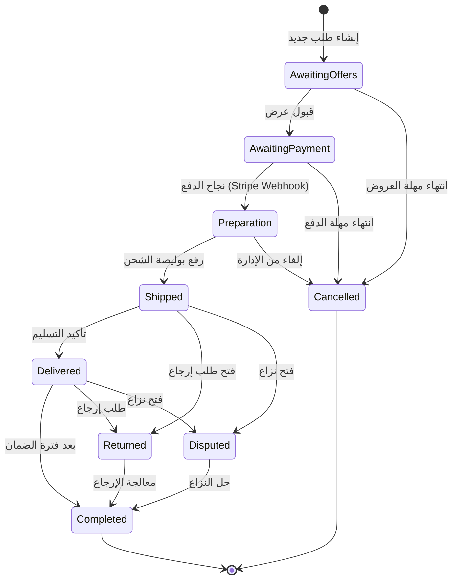
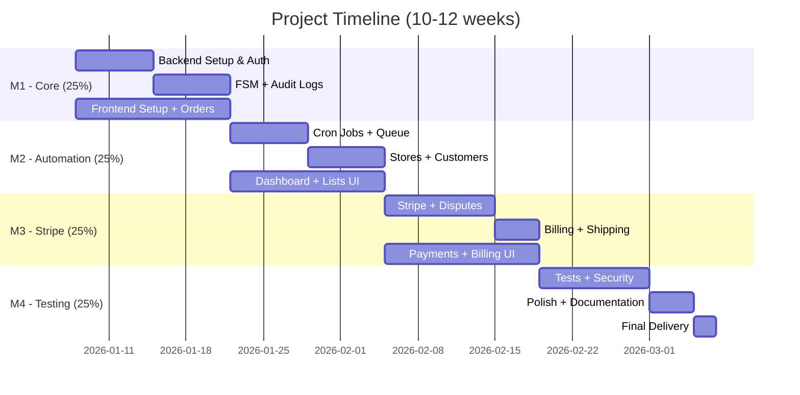
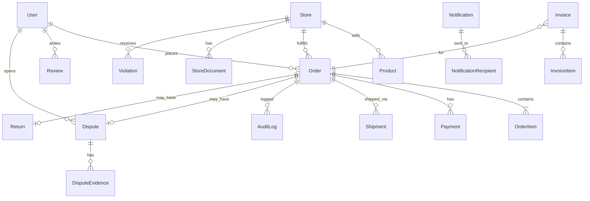

# 🏪 Marketplace Admin System

<div align="center">


**نظام إدارة متكامل للمتاجر والعملاء - Admin + Vendor Marketplace**

</div>

---

## 📋 جدول المحتويات

- [نظرة عامة](#-نظرة-عامة)
- [الأهداف الرئيسية](#-الأهداف-الرئيسية)
- [المتطلبات التقنية الحرجة](#-المتطلبات-التقنية-الحرجة)
- [البنية المعمارية](#-البنية-المعمارية)
- [الوحدات والميزات](#-الوحدات-والميزات)
- [Technology Stack](#-technology-stack)
- [نظام حالات الطلب (FSM)](#-نظام-حالات-الطلب-fsm)
- [الأتمتة والجداول الزمنية](#-الأتمتة-والجداول-الزمنية)
- [التكاملات](#-التكاملات)
- [الأمان والحماية](#-الأمان-والحماية)
- [مراحل التنفيذ](#-مراحل-التنفيذ)
- [هيكل المشروع](#-هيكل-المشروع)
- [قاعدة البيانات](#-قاعدة-البيانات)
- [API Documentation](#-api-documentation)
- [التشغيل والنشر](#-التشغيل-والنشر)

---

## 🎯 نظرة عامة

هذا المشروع هو **نظام إدارة متكامل لمنصة Marketplace** يهدف إلى إدارة كل جوانب العمليات التجارية بين المتاجر (Vendors) والعملاء (Customers) تحت إشراف الإدارة (Admin).

### ما الذي يميز هذا النظام؟

```
┌─────────────────────────────────────────────────────────────────┐
│                    Marketplace Admin System                      │
├─────────────────────────────────────────────────────────────────┤
│  ✓ FSM-Based Order Management (حتمي وموثق)                       │
│  ✓ Audit Logs لكل عملية (شفافية كاملة)                           │
│  ✓ Automated SLA Enforcement (تصعيد تلقائي)                      │
│  ✓ Stripe Integration (دفع آمن 100%)                            │
│  ✓ Real-time Notifications (WhatsApp + Email)                   │
│  ✓ Guard Protection (لا يمكن التلاعب بالحالات)                   │
└─────────────────────────────────────────────────────────────────┘
```

---

## 🎯 الأهداف الرئيسية

| الهدف | الوصف |
|-------|-------|
| **الحوكمة** | نظام مبني على قواعد صارمة لا يمكن تجاوزها |
| **الشفافية** | كل إجراء مسجل ومؤرخ مع ذكر المنفذ والسبب |
| **الأتمتة** | قواعد زمنية تعمل تلقائياً دون تدخل بشري |
| **الأمان** | حماية كاملة ضد جميع أنواع الهجمات |
| **القابلية للتوسع** | تصميم معماري يسمح بالنمو المستقبلي |

---

## ⚠️ المتطلبات التقنية الحرجة

> [!CAUTION]
> هذه المتطلبات **إلزامية** وأي إخلال بها يُعد خللاً جوهرياً في التنفيذ

### 1️⃣ Finite State Machine (FSM) - إلزامي
```
❌ ممنوع: تغيير order.status مباشرة من Controller
❌ ممنوع: تغيير order.status مباشرة من Database Query
❌ ممنوع: تغيير order.status عبر Script خارج FSM

✅ مطلوب: جميع تغييرات الحالة تمر عبر Service مركزية واحدة
```

### 2️⃣ Audit Logs - إلزامي
كل تغيير حالة يُسجل في جدول مستقل يحتوي على:
- `order_id` - معرف الطلب
- `previous_state` - الحالة السابقة
- `new_state` - الحالة الجديدة
- `actor_type` - نوع المنفذ (System / Admin / Customer / Vendor)
- `actor_id` - معرف المنفذ
- `reason` - سبب التغيير
- `timestamp` - وقت التغيير

### 3️⃣ Guard & Enforcement - إلزامي
```typescript
// يجب أن يكون هناك Guard معماري حقيقي بحيث:
// 1. يستحيل تقنياً تغيير حالة الطلب خارج FSM
// 2. أي محاولة تجاوز تفشل Runtime أو تُسقط Test
// 3. وجود FSM بدون Enforcement غير مقبول
```

---

## 🏗️ البنية المعمارية

```
┌────────────────────────────────────────────────────────────────────────┐
│                           Frontend Layer                                │
│  ┌────────────────┐  ┌────────────────┐  ┌────────────────┐            │
│  │  Admin Panel   │  │ Vendor Portal  │  │ Customer App   │            │
│  └───────┬────────┘  └───────┬────────┘  └───────┬────────┘            │
└──────────┼───────────────────┼───────────────────┼─────────────────────┘
           │                   │                   │
           ▼                   ▼                   ▼
┌────────────────────────────────────────────────────────────────────────┐
│                            API Gateway                                  │
│  ┌──────────────────────────────────────────────────────────────────┐  │
│  │  Authentication │ Authorization │ Rate Limiting │ Validation     │  │
│  └──────────────────────────────────────────────────────────────────┘  │
└────────────────────────────────────────────────────────────────────────┘
           │
           ▼
┌────────────────────────────────────────────────────────────────────────┐
│                         Application Layer                               │
│  ┌──────────────┐  ┌──────────────┐  ┌──────────────┐                  │
│  │   Orders     │  │   Stores     │  │  Customers   │                  │
│  │   Module     │  │   Module     │  │   Module     │                  │
│  └──────┬───────┘  └──────────────┘  └──────────────┘                  │
│         │                                                               │
│  ┌──────▼───────────────────────────────────────────────────────────┐  │
│  │              Order State Machine (FSM Service)                    │  │
│  │  ┌─────────┐ ┌─────────┐ ┌─────────┐ ┌─────────┐ ┌─────────┐     │  │
│  │  │ Guards  │ │Transitions│ │ Actions │ │ Events  │ │  Logs   │    │  │
│  │  └─────────┘ └─────────┘ └─────────┘ └─────────┘ └─────────┘     │  │
│  └──────────────────────────────────────────────────────────────────┘  │
│                                                                         │
│  ┌──────────────┐  ┌──────────────┐  ┌──────────────┐                  │
│  │   Billing    │  │   Disputes   │  │   Shipping   │                  │
│  │   Module     │  │   Module     │  │   Module     │                  │
│  └──────────────┘  └──────────────┘  └──────────────┘                  │
└────────────────────────────────────────────────────────────────────────┘
           │
           ▼
┌────────────────────────────────────────────────────────────────────────┐
│                         Background Services                             │
│  ┌──────────────┐  ┌──────────────┐  ┌──────────────┐                  │
│  │  Cron Jobs   │  │    Queues    │  │ Notifications│                  │
│  │  (Scheduled) │  │  (BullMQ)    │  │  (Real-time) │                  │
│  └──────────────┘  └──────────────┘  └──────────────┘                  │
└────────────────────────────────────────────────────────────────────────┘
           │
           ▼
┌────────────────────────────────────────────────────────────────────────┐
│                          Data Layer                                     │
│  ┌──────────────┐  ┌──────────────┐  ┌──────────────┐                  │
│  │  PostgreSQL  │  │    Redis     │  │  File Store  │                  │
│  │  (Primary)   │  │   (Cache)    │  │  (Documents) │                  │
│  └──────────────┘  └──────────────┘  └──────────────┘                  │
└────────────────────────────────────────────────────────────────────────┘
           │
           ▼
┌────────────────────────────────────────────────────────────────────────┐
│                      External Integrations                              │
│  ┌──────────────┐  ┌──────────────┐  ┌──────────────┐                  │
│  │    Stripe    │  │   WhatsApp   │  │    Email     │                  │
│  │  (Payments)  │  │   (Notifs)   │  │   (Notifs)   │                  │
│  └──────────────┘  └──────────────┘  └──────────────┘                  │
└────────────────────────────────────────────────────────────────────────┘
```

---

## 📦 الوحدات والميزات

### 1. 📊 لوحة الإدارة (Dashboard)

#### مؤشرات الأداء الرئيسية (KPIs)
| المؤشر | الوصف |
|--------|--------|
| عدد العملاء | إجمالي العملاء المسجلين |
| عدد المتاجر | إجمالي المتاجر النشطة |
| عدد الطلبات | اليوم / الأسبوع / الشهر |
| إجمالي المبيعات | قيمة المبيعات المكتملة |
| إجمالي العمولة | نصيب المنصة من المبيعات |

#### حالات الطلبات
```
جديد → بانتظار الدفع → قيد التجهيز → شحن → مكتمل
                    ↓           ↓        ↓
                  ملغي      إرجاع     نزاع
```

#### التنبيهات الفورية
- ⚠️ متاجر لم ترد > 24 ساعة
- ⚠️ تأخر التجهيز > 48 ساعة
- ⚠️ تأخر رفع بوليصة الشحن
- ⚠️ شحنة متأخرة > 14 يوم
- ⚠️ انتهاء ترخيص متجر
- ⚠️ تقييم متجر منخفض
- ⚠️ طلب غير مدفوع

---

### 2. 🏬 نظام المتاجر (Stores Module)

#### ملف المتجر
```
┌─────────────────────────────────────────────────┐
│                 Store Profile                    │
├─────────────────────────────────────────────────┤
│ 📋 البيانات الأساسية (الاسم، الوصف، الفئة)      │
│ 📄 الترخيص والمستندات                           │
│ 💳 وسائل الدفع + IBAN                           │
│ 👤 بيانات مسؤول المتجر                          │
│ 💰 الرصيد المالي                                │
│ ⚠️ سجل الانتهاكات                               │
└─────────────────────────────────────────────────┘
```

#### مؤشرات أداء المتجر (Store KPIs)
| المؤشر | الحد المقبول |
|--------|---------------|
| سرعة الرد | < 24 ساعة |
| سرعة التجهيز | < 48 ساعة |
| رفع البوليصة | < 24 ساعة بعد التجهيز |
| نسبة الشكاوى | < 5% |
| تقييم العملاء | >= 4.0/5 |

#### إجراءات الإدارة
- ✅ تفعيل / تعليق / إيقاف
- 🔒 Soft Block (إخفاء مؤقت)
- 💰 تعديل الرصيد
- 💬 مراجعة المحادثات
- ⚠️ إرسال تحذير

---

### 3. 👥 نظام العملاء (Customers Module)

#### ملف العميل
- البيانات الشخصية
- الأجهزة ومحاولات الدخول
- سجل الطلبات والمدفوعات
- الشكاوى المرفوعة
- طلبات الإرجاع

#### إدارة التقييمات
- تقييمات معلّقة للمراجعة
- قبول / رفض التقييم
- حذف تقييم مسيء

---

### 4. 📦 نظام الطلبات (Orders Module)

#### حالات الطلب الكاملة



#### القواعد الزمنية لكل مرحلة

| المرحلة | المدة المسموحة | الإجراء عند التجاوز |
|---------|----------------|---------------------|
| العروض | 24 ساعة | إلغاء تلقائي |
| الدفع | 24 ساعة | إلغاء تلقائي |
| التجميع | 48 ساعة | تنبيه للإدارة |
| التجهيز | 48 ساعة | تنبيه + تحذير للمتجر |
| رفع البوليصة | 24 ساعة | تنبيه + غرامة محتملة |
| الشحن | 14 يوم | فتح متابعة تلقائية |
| استلام العميل | 7 أيام | تصعيد للإدارة |

---

### 5. 🚚 الشحن والإرجاع (Shipping & Returns)

#### تتبع الشحنات
- رقم البوليصة
- شركة الشحن
- حالة الشحنة
- تاريخ التوصيل المتوقع

#### إدارة الإرجاع
```
فتح طلب إرجاع (خلال 48 ساعة)
        ↓
نقاش بين العميل والمتجر (3 أيام)
        ↓
إصدار بوليصة إرجاع
        ↓
تسليم العميل (خلال 24 ساعة)
        ↓
استلام المتجر وإتمام الإرجاع
```

---

### 6. ⚖️ نظام النزاعات (Disputes)

#### دورة حياة النزاع

```
┌─────────────────────────────────────────────────────────────────┐
│                    Dispute Lifecycle                             │
├─────────────────────────────────────────────────────────────────┤
│  1. فتح النزاع (بواسطة العميل)                                  │
│     ↓                                                            │
│  2. رفع الأدلة (العميل)                                         │
│     ↓                                                            │
│  3. رد المتجر (3 أيام كحد أقصى)                                 │
│     ↓                                                            │
│  4. تصعيد تلقائي (في حال عدم الرد)                              │
│     ↓                                                            │
│  5. مراجعة الإدارة                                               │
│     ↓                                                            │
│  6. حكم الإدارة                                                  │
│     ↓                                                            │
│  7. القرار النهائي (رد المبلغ أو تحويله للمتجر)                 │
└─────────────────────────────────────────────────────────────────┘
```

> [!IMPORTANT]
> يتم قفل رصيد الطلب مالياً فور فتح النزاع حتى صدور القرار النهائي

---

### 7. 💰 النظام المالي (Billing & Finance)

#### أنواع الفواتير
| النوع | الوصف |
|-------|-------|
| فاتورة منتج | قيمة المنتجات |
| فاتورة عمولة | نسبة المنصة |
| فاتورة شحن | تكلفة الشحن |
| فاتورة شاملة | جميع المكونات |

#### خصائص الفاتورة
- رقم تسلسلي فريد
- QR Code للتحقق
- Barcode للمسح
- حالة الدفع
- ربط بالطلب والبوليصة

---

### 8. ⚙️ الإعدادات والأتمتة (Settings & Automation)

#### إعدادات قابلة للتخصيص
- مدد التشغيل (القواعد الزمنية)
- الصلاحيات والأدوار (Roles)
- نسبة عمولة النظام
- أسعار الشحن
- الصفحات (الشروط - من نحن)
- الفئات والماركات
- تصميم الفاتورة والبوليصة
- العقد الإلكتروني

#### قواعد الأتمتة
```javascript
// أمثلة على الأتمتة
{
  "auto_cancel_unpaid": {
    "condition": "order.status === 'AWAITING_PAYMENT' && elapsed > 24h",
    "action": "cancel_order",
    "notification": ["customer", "store"]
  },
  "escalate_dispute": {
    "condition": "dispute.status === 'AWAITING_STORE' && elapsed > 3days",
    "action": "escalate_to_admin",
    "notification": ["admin"]
  },
  "license_expiry_warning": {
    "condition": "store.license_expiry <= today + 30days",
    "action": "send_warning",
    "notification": ["store", "admin"]
  }
}
```

---

### 9. 🎧 الدعم الفني (Support Module)

- تذاكر الدعم
- سجل الأعطال
- التنبيهات
- إغلاق التذاكر
- تقييم الخدمة

---

## 🛠️ Technology Stack

### Backend
```
┌─────────────────────────────────────────────┐
│  Framework:    NestJS (Node.js)             │
│  Language:     TypeScript                    │
│  Database:     PostgreSQL                    │
│  ORM:          Prisma                        │
│  Cache:        Redis                         │
│  Queue:        BullMQ                        │
│  Auth:         JWT + Passport                │
└─────────────────────────────────────────────┘
```

### Frontend
```
┌─────────────────────────────────────────────┐
│  Framework:    React / Next.js              │
│  Language:     TypeScript                    │
│  State:        Zustand / React Query        │
│  UI:           Tailwind CSS                  │
│  Charts:       Recharts                      │
│  Forms:        React Hook Form + Zod        │
└─────────────────────────────────────────────┘
```

### DevOps & Tools
```
┌─────────────────────────────────────────────┐
│  Version Control:  Git                       │
│  CI/CD:           GitHub Actions            │
│  Containerization: Docker                   │
│  Documentation:    Swagger/OpenAPI          │
│  Testing:          Jest + Supertest         │
└─────────────────────────────────────────────┘
```

---

## 🔄 نظام حالات الطلب (FSM)

### تعريف الحالات

```typescript
enum OrderStatus {
  AWAITING_OFFERS = 'awaiting_offers',      // بانتظار عروض المتاجر
  AWAITING_PAYMENT = 'awaiting_payment',    // بانتظار الدفع
  PREPARATION = 'preparation',               // قيد التجهيز
  SHIPPED = 'shipped',                       // تم الشحن
  DELIVERED = 'delivered',                   // تم التوصيل
  COMPLETED = 'completed',                   // مكتمل
  CANCELLED = 'cancelled',                   // ملغي
  RETURNED = 'returned',                     // مرتجع
  DISPUTED = 'disputed'                      // نزاع
}
```

### خريطة الانتقالات المسموحة

```typescript
const validTransitions: Record<OrderStatus, OrderStatus[]> = {
  [OrderStatus.AWAITING_OFFERS]: [
    OrderStatus.AWAITING_PAYMENT,
    OrderStatus.CANCELLED
  ],
  [OrderStatus.AWAITING_PAYMENT]: [
    OrderStatus.PREPARATION,
    OrderStatus.CANCELLED
  ],
  [OrderStatus.PREPARATION]: [
    OrderStatus.SHIPPED,
    OrderStatus.CANCELLED
  ],
  [OrderStatus.SHIPPED]: [
    OrderStatus.DELIVERED,
    OrderStatus.RETURNED,
    OrderStatus.DISPUTED
  ],
  [OrderStatus.DELIVERED]: [
    OrderStatus.COMPLETED,
    OrderStatus.RETURNED,
    OrderStatus.DISPUTED
  ],
  [OrderStatus.RETURNED]: [
    OrderStatus.COMPLETED
  ],
  [OrderStatus.DISPUTED]: [
    OrderStatus.COMPLETED,
    OrderStatus.RETURNED
  ],
  [OrderStatus.COMPLETED]: [],  // الحالة النهائية
  [OrderStatus.CANCELLED]: []   // الحالة النهائية
};
```

### FSM Service Implementation

```typescript
@Injectable()
export class OrderStateMachine {
  constructor(
    private readonly prisma: PrismaService,
    private readonly auditLogService: AuditLogService,
  ) {}

  async transitionTo(
    orderId: string,
    newStatus: OrderStatus,
    actor: Actor,
    reason: string,
  ): Promise<Order> {
    return this.prisma.$transaction(async (tx) => {
      // 1. جلب الطلب الحالي مع قفل
      const order = await tx.order.findUnique({
        where: { id: orderId },
        select: { status: true },
      });

      if (!order) {
        throw new NotFoundException('Order not found');
      }

      // 2. التحقق من صحة الانتقال
      const currentStatus = order.status as OrderStatus;
      if (!this.isValidTransition(currentStatus, newStatus)) {
        throw new ForbiddenException(
          `Invalid transition from ${currentStatus} to ${newStatus}`
        );
      }

      // 3. تنفيذ الانتقال
      const updatedOrder = await tx.order.update({
        where: { id: orderId },
        data: { 
          status: newStatus,
          updatedAt: new Date(),
        },
      });

      // 4. تسجيل في Audit Log
      await tx.auditLog.create({
        data: {
          orderId,
          previousState: currentStatus,
          newState: newStatus,
          actorType: actor.type,
          actorId: actor.id,
          reason,
          timestamp: new Date(),
        },
      });

      return updatedOrder;
    });
  }

  private isValidTransition(from: OrderStatus, to: OrderStatus): boolean {
    return validTransitions[from]?.includes(to) ?? false;
  }
}
```

### Guard Implementation

```typescript
// منع أي تغيير مباشر لـ order.status خارج FSM
@Injectable()
export class OrderStatusGuard implements CanActivate {
  canActivate(context: ExecutionContext): boolean {
    const request = context.switchToHttp().getRequest();
    
    // التأكد من أن أي تعديل للـ status يمر عبر FSM
    if (request.body?.status) {
      throw new ForbiddenException(
        'Direct status modification is not allowed. Use FSM service.'
      );
    }
    
    return true;
  }
}
```

---

## ⏰ الأتمتة والجداول الزمنية

### Cron Jobs

```typescript
@Injectable()
export class AutomationService {
  constructor(
    private readonly orderMachine: OrderStateMachine,
    private readonly notificationService: NotificationService,
  ) {}

  // يعمل كل ساعة
  @Cron('0 * * * *')
  async cancelUnpaidOrders() {
    const expiredOrders = await this.prisma.order.findMany({
      where: {
        status: OrderStatus.AWAITING_PAYMENT,
        createdAt: {
          lt: subHours(new Date(), 24),
        },
      },
    });

    for (const order of expiredOrders) {
      await this.orderMachine.transitionTo(
        order.id,
        OrderStatus.CANCELLED,
        { type: 'SYSTEM', id: 'auto-cancel-job' },
        'Payment timeout exceeded 24 hours'
      );
    }
  }

  // يعمل كل 30 دقيقة
  @Cron('*/30 * * * *')
  async alertDelayedPreparation() {
    const delayedOrders = await this.prisma.order.findMany({
      where: {
        status: OrderStatus.PREPARATION,
        updatedAt: {
          lt: subHours(new Date(), 48),
        },
      },
    });

    for (const order of delayedOrders) {
      await this.notificationService.sendAlert({
        type: 'DELAYED_PREPARATION',
        orderId: order.id,
        recipients: ['admin', 'store'],
      });
    }
  }

  // يعمل يومياً
  @Cron('0 0 * * *')
  async escalateUnrespondedDisputes() {
    const unresponded = await this.prisma.dispute.findMany({
      where: {
        status: 'AWAITING_STORE_RESPONSE',
        createdAt: {
          lt: subDays(new Date(), 3),
        },
      },
    });

    for (const dispute of unresponded) {
      await this.orderMachine.transitionTo(
        dispute.orderId,
        OrderStatus.DISPUTED,
        { type: 'SYSTEM', id: 'dispute-escalation-job' },
        'Store did not respond within 3 days - Auto escalated'
      );
    }
  }
}
```

---

## 🔌 التكاملات

### Stripe Integration

```typescript
@Injectable()
export class StripeWebhookHandler {
  constructor(
    private readonly orderMachine: OrderStateMachine,
    private readonly stripe: Stripe,
  ) {}

  async handleWebhook(payload: Buffer, signature: string) {
    // 1. التحقق من Signature
    const event = this.stripe.webhooks.constructEvent(
      payload,
      signature,
      process.env.STRIPE_WEBHOOK_SECRET,
    );

    // 2. معالجة الحدث
    switch (event.type) {
      case 'payment_intent.succeeded':
        await this.handlePaymentSuccess(event.data.object);
        break;
      case 'payment_intent.payment_failed':
        await this.handlePaymentFailure(event.data.object);
        break;
      // ... المزيد من الأحداث
    }
  }

  private async handlePaymentSuccess(paymentIntent: any) {
    const orderId = paymentIntent.metadata.orderId;
    
    await this.orderMachine.transitionTo(
      orderId,
      OrderStatus.PREPARATION,
      { type: 'SYSTEM', id: 'stripe-webhook' },
      `Payment confirmed via Stripe: ${paymentIntent.id}`
    );
  }
}
```

> [!WARNING]
> **لا يتم اعتماد أي حالة مالية إلا عبر Webhook موثوق مع Verification Signature**
> **منع التلاعب بالحالات المالية يدوياً**

### WhatsApp & Email Notifications

```typescript
@Injectable()
export class NotificationService {
  async sendWhatsApp(phone: string, template: string, data: any) {
    // Implementation using WhatsApp Business API
  }

  async sendEmail(email: string, template: string, data: any) {
    // Implementation using SendGrid or similar
  }

  async sendAlert(alert: Alert) {
    const recipients = await this.getRecipients(alert.recipients);
    
    for (const recipient of recipients) {
      if (recipient.whatsapp) {
        await this.sendWhatsApp(recipient.phone, alert.type, alert);
      }
      if (recipient.email) {
        await this.sendEmail(recipient.email, alert.type, alert);
      }
    }
  }
}
```

---

## 🔒 الأمان والحماية

### متطلبات الأمان الإلزامية

| المتطلب | التنفيذ |
|---------|---------|
| Authentication | JWT + Refresh Tokens |
| Authorization | Role-Based Access Control (RBAC) |
| Rate Limiting | Express Rate Limit + Redis |
| Input Validation | Zod + Class Validator |
| SQL Injection | Prisma Parameterized Queries |
| XSS Protection | Helmet + HTML Sanitization |
| CSRF Protection | CSRF Tokens + SameSite Cookies |
| Data Encryption | bcrypt (passwords) + AES (sensitive data) |

### Security Middleware Stack

```typescript
// app.module.ts
@Module({
  imports: [
    ThrottlerModule.forRoot({
      ttl: 60,
      limit: 100,
    }),
    // ...
  ],
})
export class AppModule {}

// main.ts
async function bootstrap() {
  const app = await NestFactory.create(AppModule);
  
  // Security headers
  app.use(helmet());
  
  // CORS
  app.enableCors({
    origin: process.env.ALLOWED_ORIGINS.split(','),
    credentials: true,
  });
  
  // Validation
  app.useGlobalPipes(new ValidationPipe({
    whitelist: true,
    forbidNonWhitelisted: true,
  }));
  
  await app.listen(3000);
}
```

---

## 📅 مراحل التنفيذ (Vertical Slicing)

> [!TIP]
> **استراتيجية التطوير**: نقوم بتطوير **Backend + Frontend معاً** في كل مرحلة، مما يضمن نظام عامل ومرئي من البداية.

```
┌─────────────────────────────────────────────────────────────────┐
│                    Vertical Slicing Approach                     │
│  ┌─────────┐  ┌─────────┐  ┌─────────┐  ┌─────────┐            │
│  │   M1    │  │   M2    │  │   M3    │  │   M4    │            │
│  │ ─────── │  │ ─────── │  │ ─────── │  │ ─────── │            │
│  │ Backend │  │ Backend │  │ Backend │  │ Backend │            │
│  │    +    │  │    +    │  │    +    │  │    +    │            │
│  │Frontend │  │Frontend │  │Frontend │  │Frontend │            │
│  │ ─────── │  │ ─────── │  │ ─────── │  │ ─────── │            │
│  │ Working │  │ Working │  │ Working │  │ Working │            │
│  │ Feature │  │ Feature │  │ Feature │  │ Feature │            │
│  └─────────┘  └─────────┘  └─────────┘  └─────────┘            │
└─────────────────────────────────────────────────────────────────┘
```

---

### 🏗️ M1: Core + Auth + Orders FSM (25%)
**المدة: 2-3 أسابيع**

#### Backend
- [ ] إعداد NestJS + Prisma + PostgreSQL
- [ ] تصميم Database Schema
- [ ] Auth Module (Login/Register + JWT)
- [ ] Order FSM Service + Guards
- [ ] Audit Logs System
- [ ] Basic CRUD APIs

#### Frontend
- [ ] إعداد Next.js + Tailwind CSS
- [ ] Layout + RTL + Dark Theme
- [ ] Login Page + Auth Context
- [ ] Orders List Page
- [ ] Order Details + Timeline
- [ ] Status Change UI

#### 🎬 Demo للعميل
```
✓ تسجيل دخول حقيقي
✓ إنشاء طلب وتغيير حالته
✓ محاولة تغيير غلط (تفشل)
✓ Audit Log يظهر كل التغييرات
```

---

### ⚙️ M2: Automation + Stores + Customers (25%)
**المدة: 2-3 أسابيع**

#### Backend
- [ ] Cron Jobs Service
- [ ] Redis + BullMQ Queue
- [ ] Notifications Service
- [ ] Stores Module (CRUD + KPIs)
- [ ] Customers Module
- [ ] SLA Rules Engine

#### Frontend
- [ ] Dashboard Page + KPIs + Charts
- [ ] Alerts Section
- [ ] Stores List + Profile Page
- [ ] Customers List + Profile Page
- [ ] Settings Page (Basic)

#### 🎬 Demo للعميل
```
✓ Dashboard بالـ KPIs والرسوم البيانية
✓ إنشاء متجر وعميل
✓ تنبيه تلقائي يظهر
✓ إلغاء طلب تلقائي بعد 24 ساعة
```

---

### 💳 M3: Stripe + Disputes + Billing (25%)
**المدة: 2-3 أسابيع**

#### Backend
- [ ] Stripe Integration + Webhooks
- [ ] Disputes Module (Lifecycle)
- [ ] Billing Module (Invoices)
- [ ] Shipping Module
- [ ] WhatsApp + Email Integration
- [ ] Advanced Security

#### Frontend
- [ ] Payment UI + Status
- [ ] Disputes Page + Evidence Upload
- [ ] Invoices Page + QR View
- [ ] Shipping Tracking
- [ ] Notification Center

#### 🎬 Demo للعميل
```
✓ دفع حقيقي بـ Stripe (Test Mode)
✓ الطلب ينتقل لـ Preparation تلقائياً
✓ فتح نزاع ورفع أدلة
✓ إنشاء فاتورة بـ QR Code
```

---

### 🧪 M4: Testing + Polish + Delivery (25%)
**المدة: 2-3 أسابيع**

#### Backend
- [ ] Unit Tests (80%+ Coverage)
- [ ] Integration Tests
- [ ] E2E Tests
- [ ] Security Audit
- [ ] API Documentation (Swagger)
- [ ] Performance Optimization

#### Frontend
- [ ] UI Polish + Animations
- [ ] Responsive Design
- [ ] Error Handling + Loading States
- [ ] Final Testing
- [ ] Build Optimization

#### 🎬 Demo للعميل
```
✓ نظام كامل شغال ومختبر
✓ Test Coverage Report
✓ Swagger Documentation
✓ فيديو شرح كامل للنظام
```

---

### 📊 ملخص المراحل

| المرحلة | Backend | Frontend | الناتج |
|---------|---------|----------|--------|
| **M1** | Auth + FSM + Audit | Login + Orders | نظام طلبات أساسي |
| **M2** | Automation + Modules | Dashboard + Lists | لوحة تحكم كاملة |
| **M3** | Stripe + Disputes | Payments + Billing | تكاملات خارجية |
| **M4** | Testing + Docs | Polish + Deploy | نظام جاهز للإنتاج |

---

### ⏰ Timeline



---

## 📁 هيكل المشروع

```
marketplace-admin-system/
├── 📂 backend/
│   ├── 📂 src/
│   │   ├── 📂 modules/
│   │   │   ├── 📂 auth/
│   │   │   │   ├── auth.controller.ts
│   │   │   │   ├── auth.service.ts
│   │   │   │   ├── auth.module.ts
│   │   │   │   ├── strategies/
│   │   │   │   └── guards/
│   │   │   ├── 📂 orders/
│   │   │   │   ├── orders.controller.ts
│   │   │   │   ├── orders.service.ts
│   │   │   │   ├── orders.module.ts
│   │   │   │   ├── fsm/
│   │   │   │   │   ├── order-state-machine.ts
│   │   │   │   │   ├── transitions.ts
│   │   │   │   │   └── guards.ts
│   │   │   │   └── dto/
│   │   │   ├── 📂 stores/
│   │   │   ├── 📂 customers/
│   │   │   ├── 📂 disputes/
│   │   │   ├── 📂 billing/
│   │   │   ├── 📂 shipping/
│   │   │   ├── 📂 notifications/
│   │   │   └── 📂 audit-logs/
│   │   ├── 📂 common/
│   │   │   ├── 📂 decorators/
│   │   │   ├── 📂 filters/
│   │   │   ├── 📂 interceptors/
│   │   │   ├── 📂 pipes/
│   │   │   └── 📂 utils/
│   │   ├── 📂 config/
│   │   ├── 📂 database/
│   │   │   └── 📂 prisma/
│   │   │       ├── schema.prisma
│   │   │       └── migrations/
│   │   ├── 📂 jobs/
│   │   │   ├── cron.service.ts
│   │   │   └── queue.processor.ts
│   │   ├── 📂 integrations/
│   │   │   ├── stripe/
│   │   │   ├── whatsapp/
│   │   │   └── email/
│   │   ├── app.module.ts
│   │   └── main.ts
│   ├── 📂 test/
│   ├── package.json
│   ├── tsconfig.json
│   └── .env.example
│
├── 📂 frontend/
│   ├── 📂 src/
│   │   ├── 📂 app/
│   │   ├── 📂 components/
│   │   ├── 📂 features/
│   │   ├── 📂 hooks/
│   │   ├── 📂 services/
│   │   ├── 📂 store/
│   │   ├── 📂 styles/
│   │   └── 📂 utils/
│   ├── package.json
│   └── next.config.js
│
├── 📂 docs/
│   ├── api/
│   ├── architecture/
│   └── deployment/
│
├── 📂 docker/
│   ├── Dockerfile.backend
│   ├── Dockerfile.frontend
│   └── docker-compose.yml
│
├── .gitignore
├── README.md
└── LICENSE
```

---

## 🗃️ قاعدة البيانات

### Entity Relationship Diagram



### Prisma Schema (Simplified)

```prisma
// schema.prisma

model User {
  id            String    @id @default(uuid())
  email         String    @unique
  phone         String?
  passwordHash  String
  role          UserRole
  createdAt     DateTime  @default(now())
  updatedAt     DateTime  @updatedAt
  
  orders        Order[]
  reviews       Review[]
  disputes      Dispute[]
}

model Store {
  id            String    @id @default(uuid())
  name          String
  description   String?
  ownerId       String
  status        StoreStatus
  balance       Decimal   @default(0)
  rating        Float     @default(0)
  licenseExpiry DateTime?
  createdAt     DateTime  @default(now())
  updatedAt     DateTime  @updatedAt
  
  owner         User      @relation(fields: [ownerId], references: [id])
  products      Product[]
  orders        Order[]
  documents     StoreDocument[]
  violations    Violation[]
}

model Order {
  id            String    @id @default(uuid())
  orderNumber   String    @unique
  customerId    String
  storeId       String?
  status        OrderStatus
  totalAmount   Decimal
  createdAt     DateTime  @default(now())
  updatedAt     DateTime  @updatedAt
  
  customer      User      @relation(fields: [customerId], references: [id])
  store         Store?    @relation(fields: [storeId], references: [id])
  items         OrderItem[]
  payments      Payment[]
  shipments     Shipment[]
  auditLogs     AuditLog[]
  dispute       Dispute?
  return        Return?
}

model AuditLog {
  id            String    @id @default(uuid())
  orderId       String
  previousState String
  newState      String
  actorType     ActorType
  actorId       String?
  reason        String
  timestamp     DateTime  @default(now())
  metadata      Json?
  
  order         Order     @relation(fields: [orderId], references: [id])
  
  @@index([orderId])
  @@index([timestamp])
}

enum OrderStatus {
  AWAITING_OFFERS
  AWAITING_PAYMENT
  PREPARATION
  SHIPPED
  DELIVERED
  COMPLETED
  CANCELLED
  RETURNED
  DISPUTED
}

enum ActorType {
  SYSTEM
  ADMIN
  CUSTOMER
  STORE
}
```

---

## 📖 API Documentation

### Authentication Endpoints

| Method | Endpoint | Description |
|--------|----------|-------------|
| POST | `/auth/login` | تسجيل الدخول |
| POST | `/auth/register` | إنشاء حساب جديد |
| POST | `/auth/refresh` | تحديث الـ Token |
| POST | `/auth/logout` | تسجيل الخروج |

### Orders Endpoints

| Method | Endpoint | Description |
|--------|----------|-------------|
| GET | `/orders` | جلب قائمة الطلبات |
| GET | `/orders/:id` | جلب تفاصيل طلب |
| POST | `/orders` | إنشاء طلب جديد |
| PATCH | `/orders/:id/transition` | تغيير حالة الطلب (عبر FSM) |
| GET | `/orders/:id/timeline` | جلب تاريخ الطلب |

### Example: Transition Order Status

```http
PATCH /orders/123e4567-e89b-12d3-a456-426614174000/transition
Authorization: Bearer <token>
Content-Type: application/json

{
  "newStatus": "shipped",
  "reason": "Order has been shipped via Aramex"
}
```

---

## 🚀 التشغيل والنشر

### متطلبات البيئة

```bash
Node.js >= 18.x
PostgreSQL >= 14
Redis >= 6
```

### التثبيت والتشغيل

```bash
# Clone the repository
git clone https://github.com/your-org/marketplace-admin-system.git
cd marketplace-admin-system

# Install dependencies
cd backend && npm install
cd ../frontend && npm install

# Setup environment
cp backend/.env.example backend/.env
# Edit .env with your credentials

# Run database migrations
cd backend
npx prisma migrate dev

# Start development servers
npm run dev         # Backend on port 3000
npm run dev:frontend # Frontend on port 3001
```

### Docker Deployment

```bash
docker-compose up -d
```

---

## 📜 معلومات العقد

| البند | التفاصيل |
|-------|----------|
| **مدة التنفيذ** | 10-12 أسبوع |
| **الضمان** | 60 يوم بعد التسليم |
| **السرية** | NDA سارية حتى بعد انتهاء العقد |
| **الملكية الفكرية** | جميع الأكواد ملك للطرف الأول |

---

## 📞 التواصل

**م. محمد عصام** - Senior Software Engineer

---

<div align="center">

**🔒 Proprietary & Confidential**

*هذا المشروع محمي بموجب اتفاقية السرية (NDA)*

</div>
