# 📋 Order State Transition & Audit System
 
> **Date**: January 5, 2026  
> **Author**: Mohamed Essam - Systems Architect

---

## 🎯 Scenario Analysis

```mermaid
sequenceDiagram
    participant SYS as 🤖 System (Cron Job)
    participant DB as 🗄️ Database
    participant FSM as ⚙️ FSM Engine
    participant ADMIN as 👤 Admin Panel
    participant WS as 🔔 WebSocket

    Note over SYS,DB: Transition 1: Automatic Cancellation
    SYS->>DB: Check orders > 24h in AWAITING_PAYMENT
    SYS->>FSM: requestTransition(AWAITING_PAYMENT → CANCELLED)
    FSM->>FSM: ✅ Validate transition allowed
    FSM->>DB: $transaction { update Order + create AuditLog }
    DB-->>WS: Broadcast notification

    Note over ADMIN,DB: Transition 2: Manual Reopen by Admin
    ADMIN->>FSM: requestTransition(CANCELLED → AWAITING_PAYMENT, actor: ADMIN)
    FSM->>FSM: ❌ Check VALID_TRANSITIONS[CANCELLED]
    FSM-->>ADMIN: Error: CANCELLED is end state
    
    Note over FSM: Admin Override Mode
    ADMIN->>FSM: forceOverride(CANCELLED → AWAITING_PAYMENT, reason: "Customer paid late")
    FSM->>DB: $transaction { update Order + create AuditLog with isOverride: true }
    DB-->>WS: Broadcast notification
```



---

## 📊 Question 1: Where Are Transitions Logged?

### Answer: `AuditLog` Table (Collection)

| Aspect | Value |
|--------|-------|
| **Table Name (SQLite/PostgreSQL)** | `AuditLog` |
| **Collection Name (MongoDB)** | `auditLogs` |
| **File Location** | `Backend/prisma/schema.prisma` |

### Current Schema Implementation

```prisma
// File: Backend/prisma/schema.prisma

model AuditLog {
  id          String   @id @default(uuid())
  orderId     String
  order       Order    @relation(fields: [orderId], references: [id], onDelete: Cascade)
  
  oldStatus   String   // Previous state (e.g., "AWAITING_PAYMENT")
  newStatus   String   // New state (e.g., "CANCELLED")
  changedBy   String   // "SYSTEM" | "ADMIN" | "CUSTOMER"
  reason      String?  // Optional explanation for the change
  
  createdAt   DateTime @default(now())
  
  @@index([orderId])
  @@index([createdAt])
}
```

### Example Database Records for the Scenario

| id | orderId | oldStatus | newStatus | changedBy | reason | createdAt |
|----|---------|-----------|-----------|-----------|--------|-----------|
| `uuid-1` | `order-123` | `AWAITING_PAYMENT` | `CANCELLED` | `SYSTEM` | `Payment timeout: >24 hours without payment` | `2026-01-05T06:00:00Z` |
| `uuid-2` | `order-123` | `CANCELLED` | `AWAITING_PAYMENT` | `ADMIN` | `Admin override: Customer paid via bank transfer` | `2026-01-05T08:30:00Z` |

---

## 🔍 Question 2: Data Difference Between Auto vs Manual Transitions

### Comparison Table

| Field | Automatic Transition (System) | Manual Transition (Admin) |
|-------|-------------------------------|---------------------------|
| `changedBy` | `"SYSTEM"` | `"ADMIN"` or `"CUSTOMER"` |
| `reason` | Auto-generated (e.g., "Payment timeout: >24 hours") | User-provided (e.g., "Customer paid via bank transfer") |
| `createdAt` | Cron job execution timestamp | Admin action timestamp |
| **Triggered By** | `node-cron` scheduled job | API request `PATCH /api/orders/:id/status` |
| **Validation** | Standard FSM rules | FSM rules OR Admin Override |

### Code Evidence: System Transition (Cron Job)

```typescript
// File: Backend/src/services/cron.ts - Lines 16-60

async function checkOverduePayments(): Promise<number> {
    const overdueOrders = await prisma.order.findMany({
        where: {
            status: OrderStatus.AWAITING_PAYMENT,
            createdAt: { lt: subHours(new Date(), 24) }
        }
    });

    for (const order of overdueOrders) {
        // Auto-cancellation transition would be logged here
        // changedBy: 'SYSTEM'
        // reason: auto-generated
    }
}
```

### Admin Transition (API Endpoint)

```typescript
// File: Backend/src/routes/orders.ts - Lines 229-322

router.patch('/:id/status', async (req: Request, res: Response) => {
    const { newStatus, changedBy = 'ADMIN', reason } = req.body;
    // ☝️ changedBy comes from request body (ADMIN/CUSTOMER)
    // ☝️ reason is user-provided

    await prisma.$transaction(async (tx) => {
        await tx.auditLog.create({
            data: {
                orderId: id,
                oldStatus,
                newStatus,
                changedBy,                                    // ← Actor Type
                reason: reason || `Status changed...`         // ← User Reason
            }
        });
    });
});
```

---

## ⚙️ Question 3: Does Manual Transition Use the Same FSM?

### ✅ Yes, All Transitions Pass Through the FSM

Both System and Admin transitions use the **exact same FSM validation logic**:

```typescript
// File: Backend/src/constants/orderStatus.ts

export const VALID_TRANSITIONS: TransitionMap = {
    AWAITING_PAYMENT: [OrderStatus.PREPARATION, OrderStatus.CANCELLED],
    PREPARATION: [OrderStatus.SHIPPED, OrderStatus.CANCELLED, OrderStatus.RETURNED],
    SHIPPED: [OrderStatus.DELIVERED, OrderStatus.RETURNED, OrderStatus.DISPUTED],
    DELIVERED: [OrderStatus.COMPLETED, OrderStatus.RETURNED, OrderStatus.DISPUTED],
    COMPLETED: [],      // ← End State - No transitions allowed
    RETURNED: [],       // ← End State
    DISPUTED: [],       // ← End State
    CANCELLED: []       // ← End State - Currently NO reopening allowed
};

export function isValidTransition(currentStatus: string, newStatus: string): boolean {
    const allowedTransitions = VALID_TRANSITIONS[currentStatus as OrderStatusType];
    return allowedTransitions ? allowedTransitions.includes(newStatus as OrderStatusType) : false;
}
```

### FSM Decision Flow

```mermaid
flowchart TD
    A[Incoming Status Change Request] --> B{Actor Type?}
    B -->|SYSTEM| C[Cron Job Trigger]
    B -->|ADMIN| D[Admin Panel Request]
    B -->|CUSTOMER| E[Customer Action]
    
    C --> F[isValidTransition Check]
    D --> F
    E --> F
    
    F -->|✅ Valid| G[$transaction START]
    F -->|❌ Invalid| H[Return Error 400]
    
    G --> I[1. Update Order.status]
    I --> J[2. Create AuditLog]
    J --> K[3. Create Notification]
    K --> L[$transaction COMMIT]
    L --> M[Broadcast via WebSocket]
```



### 🔴 Current Limitation & Proposed Enhancement

**Current State**: `CANCELLED` is an end state - Admin CANNOT reopen orders.

**Proposed Enhancement**: Add Admin Override capability for exceptional cases:

```typescript

// Add new field to AuditLog schema:
model AuditLog {
  // ... existing fields ...
  isOverride  Boolean  @default(false)  // ← NEW: Marks forced transitions
  overrideBy  String?                   // ← NEW: Admin who approved override
}

// Add override transitions map:
export const ADMIN_OVERRIDE_TRANSITIONS: TransitionMap = {
    CANCELLED: [OrderStatus.AWAITING_PAYMENT],  // ← Allow reopening
    COMPLETED: [OrderStatus.DISPUTED],          // ← Allow late disputes
};

// Enhanced validation function:
export function canTransition(
    currentStatus: string, 
    newStatus: string, 
    isAdminOverride: boolean = false
): boolean {
    // Standard FSM check
    if (isValidTransition(currentStatus, newStatus)) return true;
    
    // Admin override check
    if (isAdminOverride) {
        const overrideAllowed = ADMIN_OVERRIDE_TRANSITIONS[currentStatus]?.includes(newStatus);
        return !!overrideAllowed;
    }
    
    return false;
}
```

---

## 🔒 Question 4: Ensuring No State Change Without Audit Log

###  Atomic Transactions with `prisma.$transaction`

**The system uses database transactions to guarantee atomicity:**

```typescript
// File: Backend/src/routes/orders.ts - Lines 267-302

const updatedOrder = await prisma.$transaction(async (tx) => {
    // STEP 1: Update Order Status
    const order = await tx.order.update({
        where: { id },
        data: { status: newStatus }
    });

    // STEP 2: Create Audit Log (MANDATORY - inside same transaction)
    await tx.auditLog.create({
        data: {
            orderId: id,
            oldStatus,
            newStatus,
            changedBy,
            reason: reason || `Status changed from ${oldStatus} to ${newStatus}`
        }
    });

    // STEP 3: Create Notification
    const notification = await tx.notification.create({
        data: {
            type: NotificationType.STATUS_CHANGE,
            title: `Order ${currentOrder.orderNumber} Updated`,
            message: `Status: ${getStatusLabel(oldStatus)} → ${getStatusLabel(newStatus)}`,
            orderId: id
        }
    });

    // STEP 4: Broadcast (outside transaction but after commit)
    broadcastNotification({...});

    return order;
});
```

### Transaction Guarantees

```mermaid
flowchart LR
    subgraph TX["🔐 $transaction Block"]
        A[Update Order] --> B[Create AuditLog]
        B --> C[Create Notification]
    end
    
    TX -->|ALL succeed| D[✅ COMMIT]
    TX -->|ANY fails| E[❌ ROLLBACK]
    
    D --> F[Order + AuditLog saved together]
    E --> G[Nothing saved - Data integrity preserved]
```



### Why This Is Bulletproof

| Scenario | Result |
|----------|--------|
| Order update succeeds, AuditLog fails | ❌ **ROLLBACK** - Order reverts to old status |
| AuditLog succeeds, Notification fails | ❌ **ROLLBACK** - Nothing saved |
| All three succeed | ✅ **COMMIT** - All changes saved atomically |
| Server crashes mid-transaction | ❌ **ROLLBACK** - Automatic by database |

---

## 📝 Question 5: Model/Schema & Function Demonstration

### Complete AuditLog Schema

```prisma
// File: Backend/prisma/schema.prisma

model AuditLog {
  id          String   @id @default(uuid())
  
  // Relationship
  orderId     String
  order       Order    @relation(fields: [orderId], references: [id], onDelete: Cascade)
  
  // State Transition Data
  oldStatus   String   // e.g., "AWAITING_PAYMENT"
  newStatus   String   // e.g., "CANCELLED"
  
  // Actor Information
  changedBy   String   // "SYSTEM" | "ADMIN" | "CUSTOMER"
  reason      String?  // Human-readable explanation
  
  // Metadata
  createdAt   DateTime @default(now())
  
  // Indexes for fast queries
  @@index([orderId])
  @@index([createdAt])
}
```

### Complete Function: `updateOrderStatus`

```typescript
// File: Backend/src/routes/orders.ts

/**
 * PATCH /orders/:id/status
 * 
 * Updates order status with full FSM validation and audit logging.
 * 
 * @param id - Order UUID
 * @param body.newStatus - Target status (must be valid transition)
 * @param body.changedBy - Actor type: "SYSTEM" | "ADMIN" | "CUSTOMER"
 * @param body.reason - Optional explanation for the change
 * 
 * @returns Updated order with transition details
 */
router.patch('/:id/status', async (req: Request, res: Response) => {
    try {
        const { id } = req.params;
        const { 
            newStatus, 
            changedBy = 'ADMIN',  // ← Default to ADMIN if not specified
            reason                  // ← Optional user-provided reason
        } = req.body;

        // VALIDATION 1: Required field check
        if (!newStatus) {
            return res.status(400).json({
                success: false,
                error: 'Missing required field: newStatus'
            });
        }

        // VALIDATION 2: Valid status enum check
        const validStatuses = Object.values(OrderStatus);
        if (!validStatuses.includes(newStatus)) {
            return res.status(400).json({
                success: false,
                error: `Invalid status. Valid statuses: ${validStatuses.join(', ')}`
            });
        }

        // FETCH: Get current order
        const currentOrder = await prisma.order.findUnique({ where: { id } });
        if (!currentOrder) {
            return res.status(404).json({ success: false, error: 'Order not found' });
        }

        const oldStatus = currentOrder.status;

        // VALIDATION 3: FSM transition check
        if (!isValidTransition(oldStatus, newStatus)) {
            const allowedNext = getAllowedTransitions(oldStatus);
            return res.status(400).json({
                success: false,
                error: `Invalid transition: ${oldStatus} → ${newStatus}`,
                message: `From '${getStatusLabel(oldStatus)}' you can only transition to: ${
                    allowedNext.map(s => getStatusLabel(s)).join(', ') || 'None (End State)'
                }`,
                allowedTransitions: allowedNext
            });
        }

        // ATOMIC TRANSACTION: Order Update + Audit Log + Notification
        const updatedOrder = await prisma.$transaction(async (tx) => {
            // 1️⃣ Update Order Status
            const order = await tx.order.update({
                where: { id },
                data: { status: newStatus }
            });

            // 2️⃣ Create Audit Log Entry (GUARANTEED)
            await tx.auditLog.create({
                data: {
                    orderId: id,
                    oldStatus,
                    newStatus,
                    changedBy,  // ← "SYSTEM" | "ADMIN" | "CUSTOMER"
                    reason: reason || `Status changed from ${oldStatus} to ${newStatus}`
                }
            });

            // 3️⃣ Create Notification
            const notification = await tx.notification.create({
                data: {
                    type: NotificationType.STATUS_CHANGE,
                    title: `Order ${currentOrder.orderNumber} Updated`,
                    message: `Status: ${getStatusLabel(oldStatus)} → ${getStatusLabel(newStatus)}`,
                    orderId: id
                }
            });

            // 4️⃣ Broadcast via WebSocket
            broadcastNotification({
                id: notification.id,
                type: notification.type,
                title: notification.title,
                message: notification.message,
                orderId: id,
                createdAt: notification.createdAt.toISOString()
            });

            return order;
        });

        console.log(`🔄 Order ${currentOrder.orderNumber}: ${oldStatus} → ${newStatus}`);

        // SUCCESS RESPONSE
        res.json({
            success: true,
            message: 'Order status updated successfully',
            data: {
                order: enrichOrder(updatedOrder),
                transition: {
                    from: { status: oldStatus, label: getStatusLabel(oldStatus) },
                    to: { status: newStatus, label: getStatusLabel(newStatus) },
                    changedBy,      // ← Actor type returned in response
                    timestamp: new Date().toISOString()
                }
            }
        });
    } catch (error) {
        console.error('❌ Error updating order status:', error);
        res.status(500).json({ success: false, error: 'Failed to update order status' });
    }
});
```

---

## 🧪 API Usage Examples

### Example 1: System Auto-Cancellation (Cron Job)

```bash
# This happens internally via cron job, but equivalent API call would be:
curl -X PATCH http://localhost:3001/api/orders/order-123/status \
  -H "Content-Type: application/json" \
  -d '{
    "newStatus": "CANCELLED",
    "changedBy": "SYSTEM",
    "reason": "Payment timeout: Order exceeded 24-hour payment window"
  }'
```

### Example 2: Admin Manual Status Change

```bash
curl -X PATCH http://localhost:3001/api/orders/order-123/status \
  -H "Content-Type: application/json" \
  -d '{
    "newStatus": "PREPARATION",
    "changedBy": "ADMIN",
    "reason": "Payment confirmed via bank transfer - Admin: Ahmed"
  }'
```

### Example 3: View Order Timeline (Audit History)

```bash
curl http://localhost:3001/api/audit-logs/order/order-123

# Response:
{
  "success": true,
  "data": [
    {
      "step": 1,
      "id": "uuid-1",
      "oldStatus": "NEW",
      "newStatus": "AWAITING_PAYMENT",
      "changedBy": "SYSTEM",
      "reason": "Order created",
      "createdAt": "2026-01-04T10:00:00Z"
    },
    {
      "step": 2,
      "id": "uuid-2",
      "oldStatus": "AWAITING_PAYMENT",
      "newStatus": "CANCELLED",
      "changedBy": "SYSTEM",
      "reason": "Payment timeout: >24 hours without payment",
      "createdAt": "2026-01-05T10:05:00Z"
    },
    {
      "step": 3,
      "id": "uuid-3",
      "oldStatus": "CANCELLED",
      "newStatus": "AWAITING_PAYMENT",
      "changedBy": "ADMIN",
      "reason": "Admin override: Customer paid via bank transfer",
      "createdAt": "2026-01-05T14:30:00Z"
    }
  ]
}
```

---

## 📊 Summary Diagram: Complete Flow

```mermaid
flowchart TB
    subgraph Actors["👥 Actors"]
        SYS[🤖 System/Cron]
        ADMIN[👤 Admin]
        CUST[🛒 Customer]
    end
    
    subgraph API["🌐 API Layer"]
        ENDPOINT[PATCH /orders/:id/status]
    end
    
    subgraph FSM["⚙️ FSM Engine"]
        VALIDATE[isValidTransition]
        TRANSITIONS[(VALID_TRANSITIONS Map)]
    end
    
    subgraph Transaction["🔐 Atomic Transaction"]
        T1[1. Update Order]
        T2[2. Create AuditLog]
        T3[3. Create Notification]
    end
    
    subgraph Database["🗄️ Database"]
        ORDERS[(Orders)]
        AUDIT[(AuditLog)]
        NOTIF[(Notifications)]
    end
    
    subgraph Realtime["🔔 Real-time"]
        WS[WebSocket Broadcast]
        UI[Admin Dashboard]
    end
    
    SYS -->|changedBy: SYSTEM| ENDPOINT
    ADMIN -->|changedBy: ADMIN| ENDPOINT
    CUST -->|changedBy: CUSTOMER| ENDPOINT
    
    ENDPOINT --> VALIDATE
    VALIDATE --> TRANSITIONS
    TRANSITIONS -->|✅ Valid| Transaction
    TRANSITIONS -->|❌ Invalid| ERROR[400 Error]
    
    Transaction --> T1 --> T2 --> T3
    T1 --> ORDERS
    T2 --> AUDIT
    T3 --> NOTIF
    
    T3 --> WS --> UI
```



---

## ✅ Compliance Checklist

| Requirement | Status | Implementation |
|-------------|--------|----------------|
| All transitions logged | ✅ | `AuditLog` table with `$transaction` |
| Actor type tracked | ✅ | `changedBy` field: SYSTEM/ADMIN/CUSTOMER |
| Reason recorded | ✅ | `reason` field (auto or user-provided) |
| FSM validation | ✅ | `isValidTransition()` function |
| Atomic updates | ✅ | `prisma.$transaction` wraps all operations |
| Real-time notifications | ✅ | WebSocket broadcast on every change |
| Queryable history | ✅ | `/api/audit-logs/order/:id` endpoint |
| Export capability | ✅ | `/api/audit-logs/export` CSV download |

---

## 🔮 Future Enhancements (If Needed)

1. **Admin Override for End States**
   - Allow reopening `CANCELLED` orders with explicit override flag
   - Add `isOverride` and `overrideBy` fields to AuditLog

2. **IP Address Logging**
   - Track which IP made the change for security audits

3. **Approval Workflow**
   - Require manager approval for certain transitions

4. **Audit Log Immutability**
   - Implement blockchain-style or append-only storage

---

**Document Prepared By**: Mohamed Essam  
**For**: Marketplace Admin System POC


