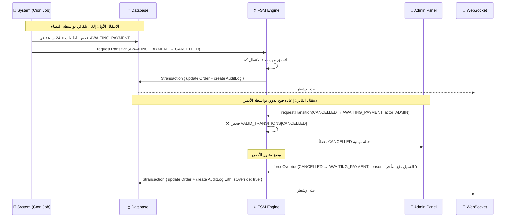
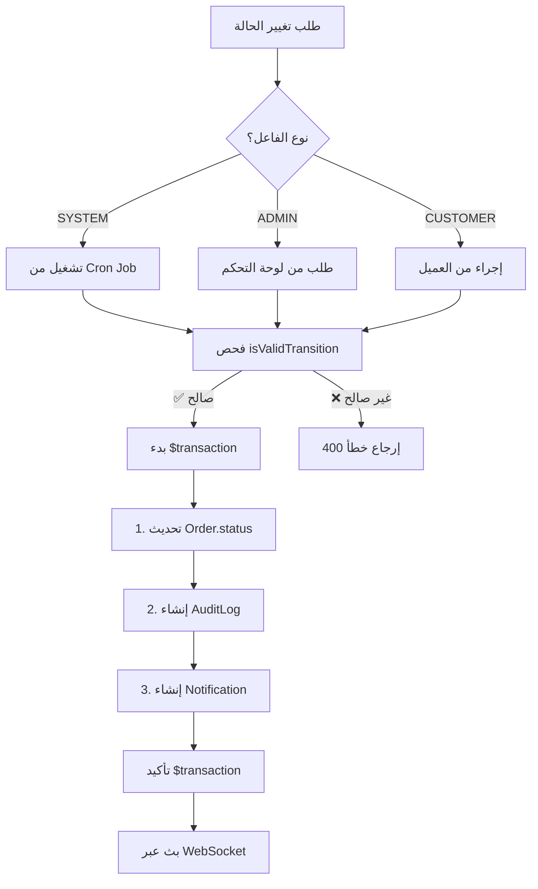
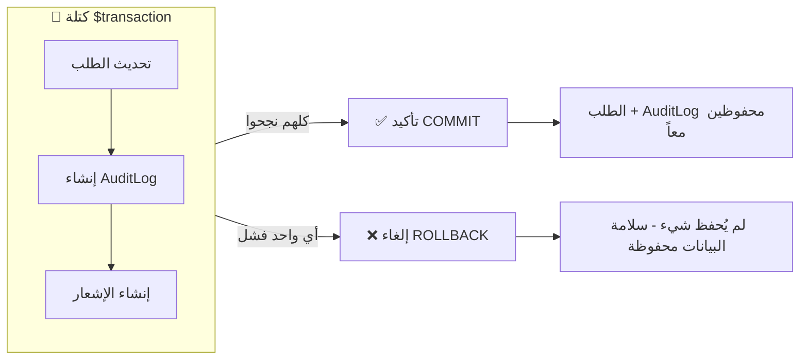
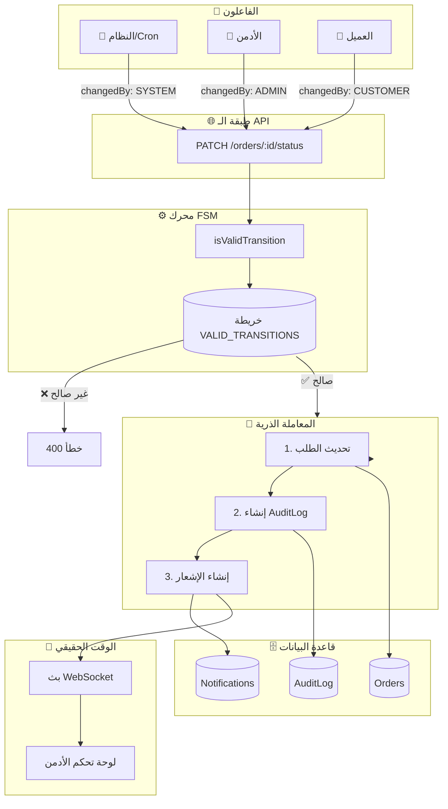

# 📋 نظام تتبع تغييرات حالة الطلب و Audit Log

> **التاريخ**: 5 يناير 2026  
> **المؤلف**: محمد عصام - مهندس أنظمة

---

## 🎯 تحليل السيناريو المطلوب

**السيناريو**: طلب انتقل من `AwaitingPayment` إلى `Cancelled` بسبب انتهاء مهلة الدفع تلقائياً (System). وبعد ذلك قام Admin بإعادة فتح الطلب يدوياً إلى `AwaitingPayment`.



---

## 📊 السؤال الأول: أين يتم تسجيل الانتقالين بالضبط؟

### الإجابة: جدول `AuditLog`

كل تغييرات الحالة يتم تسجيلها في جدول واحد اسمه `AuditLog`. هذا الجدول هو المصدر الوحيد للحقيقة (Single Source of Truth) لكل التغييرات اللي حصلت على أي طلب.

| الجانب | القيمة |
|--------|--------|
| **اسم الجدول (SQLite/PostgreSQL)** | `AuditLog` |
| **اسم المجموعة (MongoDB)** | `auditLogs` |
| **موقع الملف** | `Backend/prisma/schema.prisma` |

### هيكل الجدول الحالي (Schema)

```prisma
// File: Backend/prisma/schema.prisma

model AuditLog {
  id          String   @id @default(uuid())
  orderId     String
  order       Order    @relation(fields: [orderId], references: [id], onDelete: Cascade)
  
  oldStatus   String   // الحالة السابقة (مثال: "AWAITING_PAYMENT")
  newStatus   String   // الحالة الجديدة (مثال: "CANCELLED")
  changedBy   String   // "SYSTEM" | "ADMIN" | "CUSTOMER" - مين اللي عمل التغيير
  reason      String?  // سبب التغيير (اختياري)
  
  createdAt   DateTime @default(now())
  
  @@index([orderId])
  @@index([createdAt])
}
```

### مثال على السجلات في قاعدة البيانات للسيناريو المطلوب

الجدول ده بيوضح إزاي الانتقالين هيتسجلوا:

| id | orderId | oldStatus | newStatus | changedBy | reason | createdAt |
|----|---------|-----------|-----------|-----------|--------|-----------|
| `uuid-1` | `order-123` | `AWAITING_PAYMENT` | `CANCELLED` | `SYSTEM` | `انتهاء مهلة الدفع: >24 ساعة بدون دفع` | `2026-01-05T06:00:00Z` |
| `uuid-2` | `order-123` | `CANCELLED` | `AWAITING_PAYMENT` | `ADMIN` | `تجاوز أدمن: العميل دفع عبر تحويل بنكي` | `2026-01-05T08:30:00Z` |

**ملاحظة**: كل انتقال له سطر منفصل في الجدول، ومن خلال `changedBy` نقدر نعرف هل التغيير تم بواسطة النظام ولا الأدمن ولا العميل.

---

## 🔍 السؤال الثاني: ما الفرق في البيانات المخزنة بين الانتقال الآلي والانتقال اليدوي؟

### جدول المقارنة

| الحقل | الانتقال الآلي (System) | الانتقال اليدوي (Admin) |
|-------|-------------------------|-------------------------|
| `changedBy` | `"SYSTEM"` | `"ADMIN"` أو `"CUSTOMER"` |
| `reason` | يتولد تلقائياً (مثال: "انتهاء مهلة الدفع") | يدخله المستخدم (مثال: "العميل دفع عبر تحويل بنكي") |
| `createdAt` | وقت تنفيذ الـ Cron Job | وقت إجراء الأدمن |
| **مصدر التشغيل** | وظيفة `node-cron` المجدولة | طلب API عبر `PATCH /api/orders/:id/status` |
| **نوع التحقق** | قواعد FSM العادية | قواعد FSM أو تجاوز الأدمن |

### الفرق الجوهري

1. **في حالة النظام (System)**:
   - الـ `changedBy` دايماً بيكون `"SYSTEM"`
   - الـ `reason` بيتولد أوتوماتيك من الكود
   - بيحصل في أوقات محددة (كل دقيقة أو كل ساعة حسب إعدادات الـ Cron)

2. **في حالة الأدمن (Admin)**:
   - الـ `changedBy` بيكون `"ADMIN"` أو اسم المستخدم لو عايز تتبع أدق
   - الـ `reason` بيدخله الأدمن بنفسه (اختياري بس مهم للتوثيق)
   - بيحصل لما الأدمن ياخد إجراء من لوحة التحكم

### كود الانتقال الآلي (Cron Job)

```typescript
// File: Backend/src/services/cron.ts

async function checkOverduePayments(): Promise<number> {
    const overdueOrders = await prisma.order.findMany({
        where: {
            status: OrderStatus.AWAITING_PAYMENT,
            createdAt: { lt: subHours(new Date(), 24) }
        }
    });

    for (const order of overdueOrders) {
        // التغيير الآلي هنا
        // changedBy: 'SYSTEM' ← دايماً ثابت
        // reason: بيتولد أوتوماتيك من الكود
    }
}
```

### كود الانتقال اليدوي (API Endpoint)

```typescript
// File: Backend/src/routes/orders.ts

router.patch('/:id/status', async (req: Request, res: Response) => {
    const { newStatus, changedBy = 'ADMIN', reason } = req.body;
    // ☝️ changedBy بييجي من الـ request body (ADMIN/CUSTOMER)
    // ☝️ reason بيدخله المستخدم

    await prisma.$transaction(async (tx) => {
        await tx.auditLog.create({
            data: {
                orderId: id,
                oldStatus,
                newStatus,
                changedBy,                                    // ← نوع الفاعل
                reason: reason || `تم تغيير الحالة...`        // ← سبب المستخدم
            }
        });
    });
});
```

---

## ⚙️ السؤال الثالث: هل الانتقال اليدوي يمر عبر نفس الـ FSM أم يغير الحالة مباشرة؟

### ✅ نعم، كل الانتقالات تمر عبر نفس الـ FSM

**التصميم الحالي**: سواء كان التغيير من النظام أو من الأدمن أو من العميل، كلهم بيمروا على نفس دالة التحقق `isValidTransition()`.

ده بيضمن إن:
- ✅ مفيش حد يقدر يعمل انتقال غير مسموح
- ✅ كل التغييرات محكومة بقواعد واحدة
- ✅ لا توجد ثغرات في منطق الأعمال

### قواعد الانتقال (FSM Rules)

```typescript
// File: Backend/src/constants/orderStatus.ts

export const VALID_TRANSITIONS: TransitionMap = {
    AWAITING_PAYMENT: [OrderStatus.PREPARATION, OrderStatus.CANCELLED],
    PREPARATION: [OrderStatus.SHIPPED, OrderStatus.CANCELLED, OrderStatus.RETURNED],
    SHIPPED: [OrderStatus.DELIVERED, OrderStatus.RETURNED, OrderStatus.DISPUTED],
    DELIVERED: [OrderStatus.COMPLETED, OrderStatus.RETURNED, OrderStatus.DISPUTED],
    COMPLETED: [],      // ← حالة نهائية - لا انتقالات مسموحة
    RETURNED: [],       // ← حالة نهائية
    DISPUTED: [],       // ← حالة نهائية
    CANCELLED: []       // ← حالة نهائية - حالياً لا يمكن إعادة فتح الطلب
};

export function isValidTransition(currentStatus: string, newStatus: string): boolean {
    const allowedTransitions = VALID_TRANSITIONS[currentStatus as OrderStatusType];
    return allowedTransitions ? allowedTransitions.includes(newStatus as OrderStatusType) : false;
}
```

### مسار اتخاذ القرار في FSM



### 🔴 القيد الحالي والتحسين المقترح

**الوضع الحالي**: `CANCELLED` هي حالة نهائية - الأدمن **لا يستطيع** إعادة فتح الطلبات الملغاة.

**التحسين المقترح**: إضافة إمكانية تجاوز الأدمن للحالات الاستثنائية:

```typescript
// إضافة حقل جديد لـ AuditLog schema:
model AuditLog {
  // ... الحقول الموجودة ...
  isOverride  Boolean  @default(false)  // ← جديد: يحدد إذا كان تجاوز قسري
  overrideBy  String?                   // ← جديد: الأدمن الذي وافق على التجاوز
}

// إضافة خريطة انتقالات التجاوز:
export const ADMIN_OVERRIDE_TRANSITIONS: TransitionMap = {
    CANCELLED: [OrderStatus.AWAITING_PAYMENT],  // ← السماح بإعادة الفتح
    COMPLETED: [OrderStatus.DISPUTED],          // ← السماح بنزاعات متأخرة
};

// دالة تحقق محسنة:
export function canTransition(
    currentStatus: string, 
    newStatus: string, 
    isAdminOverride: boolean = false
): boolean {
    // فحص FSM العادي
    if (isValidTransition(currentStatus, newStatus)) return true;
    
    // فحص تجاوز الأدمن
    if (isAdminOverride) {
        const overrideAllowed = ADMIN_OVERRIDE_TRANSITIONS[currentStatus]?.includes(newStatus);
        return !!overrideAllowed;
    }
    
    return false;
}
```

---

## 🔒 السؤال الرابع: كيف تضمن أن أي تغيير حالة لا يمكن أن يحدث بدون تسجيل Audit Log؟

### الإجابة: المعاملات الذرية باستخدام `prisma.$transaction`

**المبدأ الأساسي**: تحديث الطلب وإنشاء الـ Audit Log يحدثان **داخل نفس المعاملة (Transaction)**. يعني إما ينجحوا الاتنين مع بعض، أو يفشلوا الاتنين مع بعض.

**ليه ده مهم؟**
- 🔒 مستحيل يتغير الطلب من غير ما يتسجل في الـ Audit Log
- 🔒 لو حصل أي خطأ، كل التغييرات بترجع لحالتها الأصلية
- 🔒 ضمان سلامة البيانات 100%

### الكود الفعلي

```typescript
// File: Backend/src/routes/orders.ts

const updatedOrder = await prisma.$transaction(async (tx) => {
    // الخطوة 1: تحديث حالة الطلب
    const order = await tx.order.update({
        where: { id },
        data: { status: newStatus }
    });

    // الخطوة 2: إنشاء سجل Audit Log (إجباري - داخل نفس المعاملة)
    await tx.auditLog.create({
        data: {
            orderId: id,
            oldStatus,
            newStatus,
            changedBy,
            reason: reason || `تم تغيير الحالة من ${oldStatus} إلى ${newStatus}`
        }
    });

    // الخطوة 3: إنشاء إشعار
    const notification = await tx.notification.create({
        data: {
            type: NotificationType.STATUS_CHANGE,
            title: `تم تحديث الطلب ${currentOrder.orderNumber}`,
            message: `الحالة: ${getStatusLabel(oldStatus)} → ${getStatusLabel(newStatus)}`,
            orderId: id
        }
    });

    // الخطوة 4: البث (بعد تأكيد المعاملة)
    broadcastNotification({...});

    return order;
});
```

### ضمانات المعاملة



### جدول السيناريوهات

| السيناريو | النتيجة |
|-----------|---------|
| تحديث الطلب نجح، AuditLog فشل | ❌ **إلغاء** - الطلب يرجع لحالته القديمة |
| AuditLog نجح، الإشعار فشل | ❌ **إلغاء** - لم يُحفظ شيء |
| الثلاثة نجحوا | ✅ **تأكيد** - كل التغييرات محفوظة ذرياً |
| السيرفر توقف في منتصف المعاملة | ❌ **إلغاء** - تلقائي من قاعدة البيانات |

**الخلاصة**: مستحيل هيكلياً إن الطلب يتغير من غير ما يتسجل في الـ Audit Log بسبب استخدام المعاملات الذرية.

---

## 📝 السؤال الخامس: Model/Schema للـ Audit Log ودالة تغيير حالة الطلب

### هيكل AuditLog الكامل (Schema)

```prisma
// File: Backend/prisma/schema.prisma

model AuditLog {
  id          String   @id @default(uuid())
  
  // العلاقة مع الطلب
  orderId     String
  order       Order    @relation(fields: [orderId], references: [id], onDelete: Cascade)
  
  // بيانات انتقال الحالة
  oldStatus   String   // مثال: "AWAITING_PAYMENT"
  newStatus   String   // مثال: "CANCELLED"
  
  // معلومات الفاعل
  changedBy   String   // "SYSTEM" | "ADMIN" | "CUSTOMER"
  reason      String?  // شرح مقروء للإنسان
  
  // البيانات الوصفية
  createdAt   DateTime @default(now())
  
  // فهارس للاستعلامات السريعة
  @@index([orderId])
  @@index([createdAt])
}
```

### الدالة الكاملة: `updateOrderStatus`

```typescript
// File: Backend/src/routes/orders.ts

/**
 * PATCH /orders/:id/status
 * 
 * تحديث حالة الطلب مع التحقق الكامل من FSM وتسجيل Audit Log.
 * 
 * @param id - معرف الطلب UUID
 * @param body.newStatus - الحالة الهدف (يجب أن تكون انتقال صالح)
 * @param body.changedBy - نوع الفاعل: "SYSTEM" | "ADMIN" | "CUSTOMER"
 * @param body.reason - شرح اختياري للتغيير
 * 
 * @returns الطلب المحدث مع تفاصيل الانتقال
 */
router.patch('/:id/status', async (req: Request, res: Response) => {
    try {
        const { id } = req.params;
        const { 
            newStatus, 
            changedBy = 'ADMIN',  // ← افتراضي ADMIN إذا لم يُحدد
            reason                  // ← سبب اختياري من المستخدم
        } = req.body;

        // التحقق 1: فحص الحقول المطلوبة
        if (!newStatus) {
            return res.status(400).json({
                success: false,
                error: 'الحقل المطلوب مفقود: newStatus'
            });
        }

        // التحقق 2: فحص صلاحية الحالة
        const validStatuses = Object.values(OrderStatus);
        if (!validStatuses.includes(newStatus)) {
            return res.status(400).json({
                success: false,
                error: `حالة غير صالحة. الحالات الصالحة: ${validStatuses.join(', ')}`
            });
        }

        // جلب الطلب الحالي
        const currentOrder = await prisma.order.findUnique({ where: { id } });
        if (!currentOrder) {
            return res.status(404).json({ success: false, error: 'الطلب غير موجود' });
        }

        const oldStatus = currentOrder.status;

        // التحقق 3: فحص انتقال FSM
        if (!isValidTransition(oldStatus, newStatus)) {
            const allowedNext = getAllowedTransitions(oldStatus);
            return res.status(400).json({
                success: false,
                error: `انتقال غير صالح: ${oldStatus} → ${newStatus}`,
                message: `من '${getStatusLabel(oldStatus)}' يمكنك الانتقال فقط إلى: ${
                    allowedNext.map(s => getStatusLabel(s)).join(', ') || 'لا شيء (حالة نهائية)'
                }`,
                allowedTransitions: allowedNext
            });
        }

        // المعاملة الذرية: تحديث الطلب + Audit Log + الإشعار
        const updatedOrder = await prisma.$transaction(async (tx) => {
            // 1️⃣ تحديث حالة الطلب
            const order = await tx.order.update({
                where: { id },
                data: { status: newStatus }
            });

            // 2️⃣ إنشاء سجل Audit Log (مضمون)
            await tx.auditLog.create({
                data: {
                    orderId: id,
                    oldStatus,
                    newStatus,
                    changedBy,  // ← "SYSTEM" | "ADMIN" | "CUSTOMER"
                    reason: reason || `تم تغيير الحالة من ${oldStatus} إلى ${newStatus}`
                }
            });

            // 3️⃣ إنشاء إشعار
            const notification = await tx.notification.create({
                data: {
                    type: NotificationType.STATUS_CHANGE,
                    title: `تم تحديث الطلب ${currentOrder.orderNumber}`,
                    message: `الحالة: ${getStatusLabel(oldStatus)} → ${getStatusLabel(newStatus)}`,
                    orderId: id
                }
            });

            // 4️⃣ البث عبر WebSocket
            broadcastNotification({
                id: notification.id,
                type: notification.type,
                title: notification.title,
                message: notification.message,
                orderId: id,
                createdAt: notification.createdAt.toISOString()
            });

            return order;
        });

        console.log(`🔄 الطلب ${currentOrder.orderNumber}: ${oldStatus} → ${newStatus}`);

        // رد النجاح
        res.json({
            success: true,
            message: 'تم تحديث حالة الطلب بنجاح',
            data: {
                order: enrichOrder(updatedOrder),
                transition: {
                    from: { status: oldStatus, label: getStatusLabel(oldStatus) },
                    to: { status: newStatus, label: getStatusLabel(newStatus) },
                    changedBy,      // ← نوع الفاعل في الرد
                    timestamp: new Date().toISOString()
                }
            }
        });
    } catch (error) {
        console.error('❌ خطأ في تحديث حالة الطلب:', error);
        res.status(500).json({ success: false, error: 'فشل تحديث حالة الطلب' });
    }
});
```

---

## 🧪 أمثلة استخدام الـ API

### مثال 1: إلغاء تلقائي من النظام (Cron Job)

```bash
# هذا يحدث داخلياً عبر cron job، لكن النداء المكافئ للـ API:
curl -X PATCH http://localhost:3001/api/orders/order-123/status \
  -H "Content-Type: application/json" \
  -d '{
    "newStatus": "CANCELLED",
    "changedBy": "SYSTEM",
    "reason": "انتهاء مهلة الدفع: الطلب تجاوز 24 ساعة بدون دفع"
  }'
```

### مثال 2: تغيير حالة يدوي من الأدمن

```bash
curl -X PATCH http://localhost:3001/api/orders/order-123/status \
  -H "Content-Type: application/json" \
  -d '{
    "newStatus": "PREPARATION",
    "changedBy": "ADMIN",
    "reason": "تم تأكيد الدفع عبر تحويل بنكي - الأدمن: أحمد"
  }'
```

### مثال 3: عرض تاريخ الطلب (Audit History)

```bash
curl http://localhost:3001/api/audit-logs/order/order-123

# الرد:
{
  "success": true,
  "data": [
    {
      "step": 1,
      "id": "uuid-1",
      "oldStatus": "NEW",
      "newStatus": "AWAITING_PAYMENT",
      "changedBy": "SYSTEM",
      "reason": "تم إنشاء الطلب",
      "createdAt": "2026-01-04T10:00:00Z"
    },
    {
      "step": 2,
      "id": "uuid-2",
      "oldStatus": "AWAITING_PAYMENT",
      "newStatus": "CANCELLED",
      "changedBy": "SYSTEM",
      "reason": "انتهاء مهلة الدفع: >24 ساعة بدون دفع",
      "createdAt": "2026-01-05T10:05:00Z"
    },
    {
      "step": 3,
      "id": "uuid-3",
      "oldStatus": "CANCELLED",
      "newStatus": "AWAITING_PAYMENT",
      "changedBy": "ADMIN",
      "reason": "تجاوز أدمن: العميل دفع عبر تحويل بنكي",
      "createdAt": "2026-01-05T14:30:00Z"
    }
  ]
}
```

---

## 📊 مخطط التدفق الكامل



---

## ✅ قائمة التحقق من المتطلبات

| المتطلب | الحالة | التنفيذ |
|---------|--------|---------|
| تسجيل كل الانتقالات | ✅ | جدول `AuditLog` مع `$transaction` |
| تتبع نوع الفاعل | ✅ | حقل `changedBy`: SYSTEM/ADMIN/CUSTOMER |
| تسجيل السبب | ✅ | حقل `reason` (آلي أو من المستخدم) |
| التحقق من FSM | ✅ | دالة `isValidTransition()` |
| التحديثات الذرية | ✅ | `prisma.$transaction` تغلف كل العمليات |
| إشعارات الوقت الحقيقي | ✅ | بث WebSocket على كل تغيير |
| تاريخ قابل للاستعلام | ✅ | نقطة نهاية `/api/audit-logs/order/:id` |
| إمكانية التصدير | ✅ | تحميل CSV عبر `/api/audit-logs/export` |

---

## 🔮 تحسينات مستقبلية (إذا لزم الأمر)

1. **تجاوز الأدمن للحالات النهائية**
   - السماح بإعادة فتح الطلبات الملغاة مع علامة تجاوز صريحة
   - إضافة حقول `isOverride` و `overrideBy` لـ AuditLog

2. **تسجيل عنوان IP**
   - تتبع أي IP قام بالتغيير للتدقيق الأمني

3. **سير عمل الموافقة**
   - طلب موافقة المدير لانتقالات معينة

4. **عدم قابلية تغيير Audit Log**
   - تنفيذ تخزين على غرار blockchain أو append-only

---

**إعداد الوثيقة**: محمد عصام  
**لـ**: نظام إدارة السوق POC

